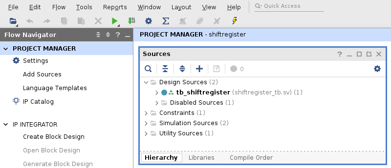
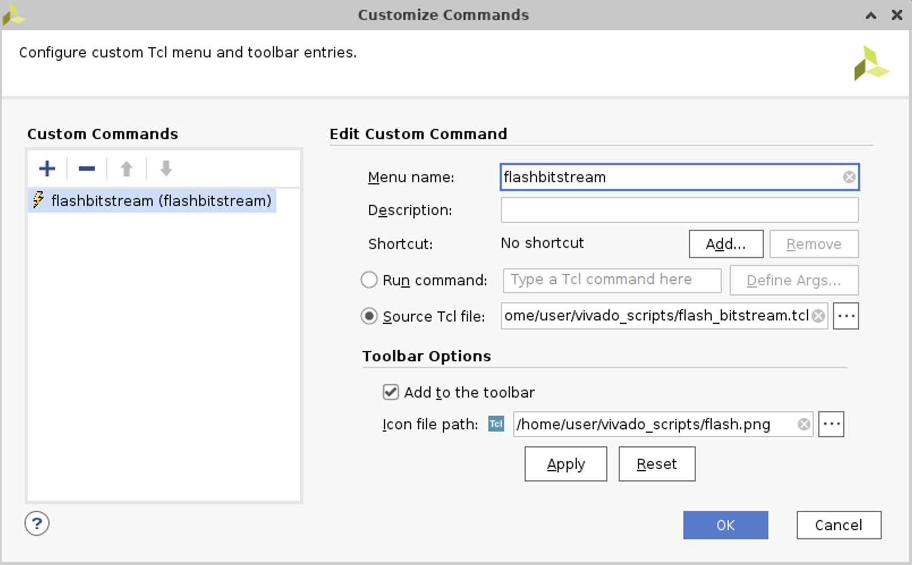

# Xilinx Vivado Flasher Icon

Adding a bitstream flasher icon to Xilinx Vivado 2022.2

The added icon will look like this - a flash - in the menu bar:

To install:

* Put the *flash_bitstream.tcl* script and the icon *flash.png* in a folder like */home/user/vivado_scripts*.
* Set a new custom command via *Tools / Custom Commands / Customize Commands* and specify the .tcl script and the icon.

The flasher icon was taken from [Flaticon](https://www.flaticon.com/free-icon/flash_252590).
Please mind the copyright.
